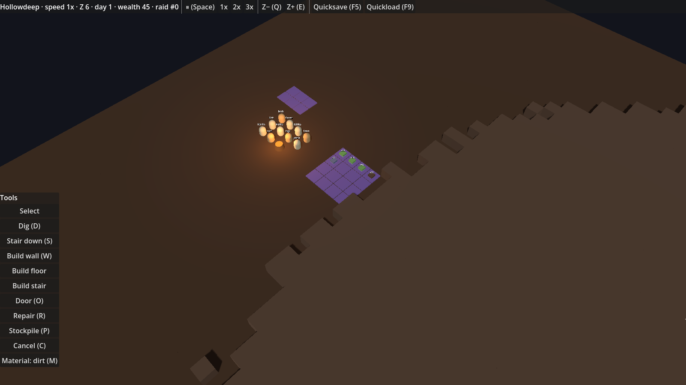
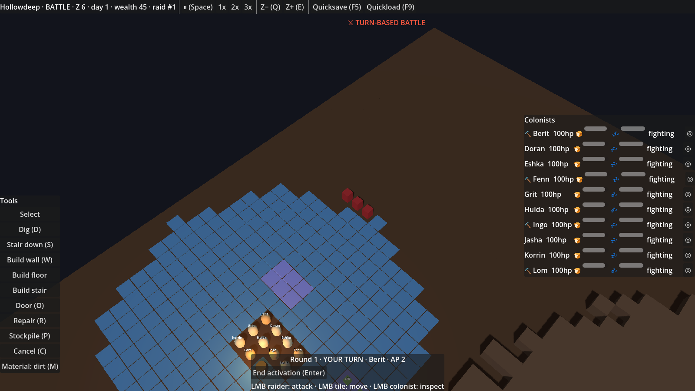

# HOLLOWDEEP

> Carve a colony into a cube-world mountain, layer by layer, in real time. When raiders
> breach, the game shifts to XCOM-style turn-based squad combat fought inside your own
> architecture — every corridor, chokepoint, and hall you carved is the tactics map.

A colony-sim / turn-based-tactics hybrid built in one autonomous effort. **The base
layout IS the tactics map** — there is no separate battle screen.




## Download & play (no tools needed)

**Windows**: grab [`dist/Hollowdeep-windows-x86_64.zip`](dist/Hollowdeep-windows-x86_64.zip)
(GitHub shows a **Download raw** button), unzip anywhere, keep `Hollowdeep.exe` next to
its `data_…` folder, double-click. SmartScreen may warn (unsigned build): *More info →
Run anyway*. Controls and the game loop are in the bundled `README.txt`.

A Linux build exports identically from the committed preset:
`godot --headless --export-release "Linux/X11" build/linux/Hollowdeep.x86_64`.

## Running from source

Requires **Godot 4.7.1 mono** and the **.NET 8 SDK**.

```sh
godot --path .            # or open project.godot in the editor and press Play
```

- First launch generates the fixed-seed mountain with 10 colonists; later launches
  resume your newest save automatically — including mid-battle checkpoints.
- **Space** pause · **1/2/3** speed · **Q/E** Z-level cutaway · **Esc** pause menu
  (save/load slots, new colony) · **F5/F9** quicksave/load · **F12** debug console
  (`help` lists commands, `spawn_raid` starts the fun early, `perf` shows budgets).
- Drag with the left mouse button to paint designations (pick High/Norm/Low priority
  in the palette); right-click rallies the selected colonist during a raid warning.
  In battle: click a tile to move, a raider to attack, **Enter** to end the activation;
  the combat log narrates every roll.

## Tests & verification

```sh
dotnet test                       # 47 tests: determinism, byte-identical saves,
                                  # checkpoint resume, pathfinding law, mode switch,
                                  # a 2-sim-day endurance run, 0 B/sub-step allocation
tools/check-core-purity.sh        # the simulation assembly has zero Godot references
```

The headless smoke (dig → raid → battle → reconcile → repair, hash-stable across runs)
runs as part of the suite (`SmokeTests`) and in-game via the console command `smoke`.

## Repository layout

| Path | Contents |
|---|---|
| `src/core/` | `Hollowdeep.Core` — the entire simulation, plain C#, no Godot |
| `src/game/` | Godot views, input, UI, debug console (presentation only) |
| `scenes/` | The single boot scene |
| `tests/` | xUnit suite over the core |
| `DECISIONS.md` | Every judgment call the spec left open, with rationale |
| `BUILD-REPORT.md` | Honest status: verified / unverified / cut |

## Architecture in one breath

One shared world; a swappable **time authority** (real-time fixed-dt sub-stepping vs
turn-based activations) is the only path that advances state. Terrain is a chunked
grid of packed 8-byte cells behind a single write facade with batched change events;
entities live in typed stores written only through per-system writer interfaces that
assert the mutation window, active mode, and id kind. Mode switches convert zero
state. Saves are gzip binary, byte-identical on round trip; battles persist through a
rolling coalesce-newest checkpoint written at activation boundaries.
